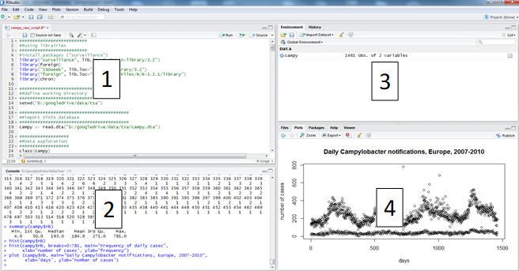
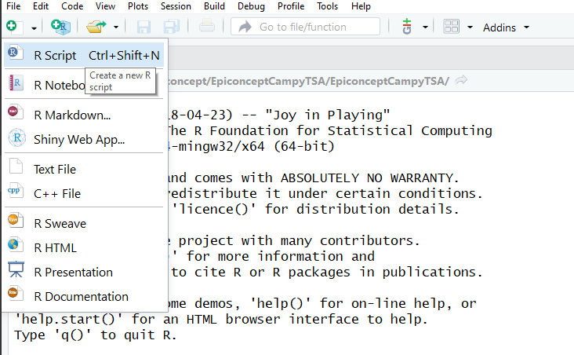
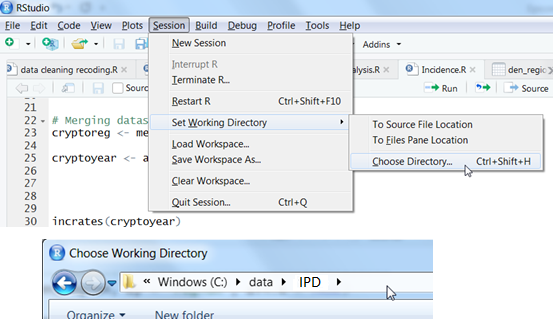
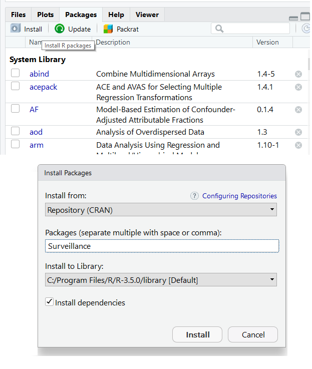
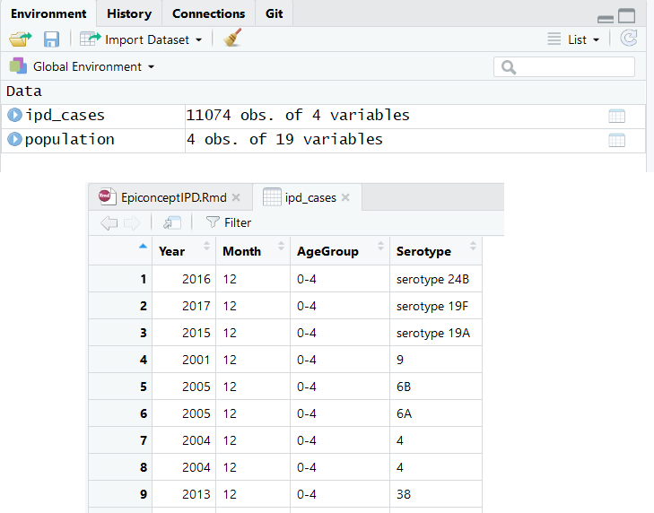

```{r setup, include = FALSE}
knitr::opts_chunk$set(
  echo = TRUE,
  oncordance = TRUE,
  message = FALSE,
  warning = FALSE,
  fig.width = 9,
  fig.height = 6
  )
```

```{r packages4knit, echo = FALSE}
#load packages
  #Those required for creating this markdown: 
    #"Worded": for styling and pagebreaks (devtools::install_github("davidgohel/worded"))
    #"knitr": for styling tables
required_packages <- c("worded", "knitr") 

for (i in seq(along = required_packages)) {
  library(required_packages[i], character.only = TRUE)
}
 
```

<!---CHUNK_PAGEBREAK--->

# Copyright and License 

**Source:** 

This case study was first designed by Lukas Richter and Alexander Spina in 2018 using *R*. It is based on surveillance data from an Scotland.  

**Revisions:** 

*If you modify this case study, please indicate below your name and changes you made*  

**You are free:** 

- **to Share** — to copy, distribute and transmit the work 
- **to Remix** — to adapt the work 

**Under the following conditions:** 

- **Attribution** — 	You must attribute the work in the manner specified by the author or licensor (but not in any way that suggests that they endorse you or your use of the work). The best way to do this is to keep as it is the list of contributors: sources, authors and reviewers. 
- **Share Alike** — 	If you alter, transform, or build upon this work, you may distribute the resulting work only under the same or similar license to this one. Your changes must be documented. Under that condition, you are allowed to add your name to the list of contributors. 
- You cannot sell this work alone but you can use it as part of a teaching. 

**With the understanding that:** 

- **Waiver** — Any of the above conditions can be waived if you get permission from the copyright holder. 
- **Public Domain** — 	Where the work or any of its elements is in the public domain under applicable law, that status is in no way affected by the license. 
- **Other Rights** — In no way are any of the following rights affected by the license: 
  - Your fair dealing or fair use rights, or other applicable copyright exceptions and limitations; 
  - The author's moral rights; 
  - Rights other persons may have either in the work itself or in how the work is used, such as publicity or privacy rights. 
- **Notice** — 	For any reuse or distribution, you must make clear to others the license terms of this work by keeping together this work and the current license. 


This licence is based on http://creativecommons.org/licenses/by-sa/3.0/

<!---CHUNK_PAGEBREAK--->

## Objectives of the tutorial 

At the end of the tutorial participants should be able to 

- create a plan of analysis for simple segmented regression
- use R for exploratory analysis including installing the software, importing a dataset, setting time units for aggregation, data checking, investigating trend and seasonality 
- understand how to run a simple negative binomial segmented regression 


## Background to the tutorial

The objective of the tutorial is to carry out an analysis on the effect of a vaccine intervention on the incidence of invasive pneumococcal disease (IPD). 

There are two available vaccines for IPD, one which covers seven serotypes and one which covers 13 serotypes, called PCV7 and PCV13 respectively. 

The dataset is Scottish surveillance data from 2000 to 2017. This includes several years of pre-vaccination data (2000-2006), 3 years of PCV7 years (2007-2009) and 8 years of PCV13 years (2010-2017). 

The dataset is case-based (every row is a case) and provides the year and month of notification, the age group, and the serotype. 

In addition, there are population counts for Scotland between 2000 and 2017 overall and broken down by age group. 

<!---CHUNK_PAGEBREAK---> 

# Question 1
Open the datasets (*ipd_cases.csv* and *ipd_population.csv*) in R and briefly explore them (make sure your working directory is set in R). Import the necessary packages and install the corresponding packages.
With the assumption that the reporting in the dataset here is stable over time, create an outline of a mini-protocol for the analysis, including hypotheses to be tested, a plan of analysis, with specifications for the dataset, inclusion/exclusion criteria, etc. 

<!---CHUNK_PAGEBREAK---> 

# Help Question 1 

## R-Studio environment

*R-Studio* is an integrated development environment (IDE) for *R*. It includes a console, syntax highlighting editor that supports direct code execution, as well as tools for plotting, history, debugging and workspace management. You can download it freely from the [*R-Studio* website](https://www.rstudio.com/). 

The *RStudio* window comprises the following sections: 

 


1. A script which is equivalent to a do file in STATA or pgn in EpiInfo. 
2. A console where you can write commands and execute them, and where results other than graphs are shown.
3. A “Environment” and “History” windows where you can find the list of R objects being stored and the log of your session, respectively. 
4. The “Plots”, “Packages” and “Help” windows, for graphic visualisation, selection of installed packages and help documentation, respectively. 


## R-scripts
Throughout this case study we strongly encourage you to use *R-scripts* to keep track of the commands you are using to follow your plan of analysis. It will contain data management steps as well as descriptive and statistical analysis. 

Open R studio and open a new *R-script*. 
To open a new *R-script*, click on the plus button on the top left (below File), then select *R-script* from the drop-down menu. 

 


## Working directory 
Make sure you have created a working directory on your computer. This is where you store your data and your R scripts and outputs. An example of working directory could be “C:/data/crypto” if you are using a PC.
To set your working directory you can use the menu function by clicking "Session" > "Set Working Directory" > "Choose Directory..." and then you can select the appropriate folder. 

 


You could alternatively do this by adding code to your *R-script* (or the command line). 

You can check the path for your current working directory using the *getwd* function.

```{r, eval = FALSE}
#Check your current working directory
getwd()

```

To set your working directory you can use the *setwd* function. 

```{r, eval = FALSE}
#set working directory 
  #note the forward rather than backwards slashes
setwd("C:/data/IPD")

```


## Packages 

R comes with a set of default functions. However one of the strengths of R is that many user-written functions exist to help you do your work. To use them, you first need to install the package they belong to. 
To do this you can click on "Install" on the bottom right in the "Packages" window. 

 


<!---CHUNK_PAGEBREAK---> 

We will mainly use packages which come ready installed with R (base code), but where it makes things easier we will use add-on packages. All the R packages you need for the exercises can be installed over the Internet.

You will need to install these before starting. We will be using the following packages. 

- *zoo*: for producing rolling statistics and year-months
- *MASS*: for performing negative binomial regression
- *broom*: for tidying and formatting model outputs


You can also install packages using the *install.packages* function, as below. Do not try to understand this code. 


```{r}
#choose packages required 
required_packages <- c("zoo", "MASS", "broom")
```
```{r, eval = FALSE}
# Installing required packages for this case study
for (pkg in required_packages) {
  if (!pkg %in% rownames(installed.packages())) {
    install.packages(pkg, dependencies = TRUE)
  }
}
```


You only need to install packages once. However you will need to load them each time you start a new session using the *library* function. 

```{r, eval = FALSE}
library(MASS)
```

Here too, you can load multiple packages at the same time within a loop; again do not try to understand this just yet, just appreciate it is possible. 

```{r, results = 'hide', message = FALSE, warning = FALSE}

# Loading required packages for this case study
for (i in seq(along = required_packages)) {
  library(required_packages[i], character.only = TRUE)
}
```

<!---CHUNK_PAGEBREAK---> 


## Reading in data

Import the dataset from a comma seperated file (.csv) using the `read.csv` function, storing it as a dataframe within *R* called *ipd_cases*. Also import population data using the same approach (*population*). For a CSV file the separator is normally a comma (","), however depending on the language of your operating system this can also be other values, for example some non-english speaking European countries use a semi-colon (";") as standard. Here we also specify that we do not want to format strings as factors. When reading population data we additionally define the option `check.names = FALSE` which makes sure that variable names are kept as defined in the CSV. By default (`check.names = TRUE`) *R* would automatically change column names to follow certain rules (e.g. no numeric as first character).

```{r read_data}
# read in your cases dataset
ipd_cases <- read.csv("data/ipd_cases.csv", sep = ",", stringsAsFactors = FALSE)

# read in your population dataset
population <- read.csv("data/ipd_population.csv", sep = ",", 
                       stringsAsFactors = FALSE, check.names = FALSE)
```


## Browse data

Take a look at the first 10 rows of the data or browse the dataframe in the RStudio preview.

```{r, eval = FALSE}
# view the first ten rows of data
head(ipd_cases, n = 10)

# view your whole dataset 
View(ipd_cases)
```

Remember that `View` needs to be written with a capital *V*.

```{r, echo = FALSE}
# participants dont see this code
  # creates nice table output for word doc
kable(head(ipd_cases, n = 10))
```

Alternatively you can view the data by clicking on the data by clicking on the data icon to the right of the view. 

 

Another option is to use *R*'s `str` function to display the structure of an *R* object compactly.

```{r}
str(ipd_cases)
```

You get a short overview of the dimensions of the dataset (number of observations, number of variables) and additionally the class of each variable including the first couple of observations.

It is often useful to inspect character and factor variables separately to get to know the used values and labels and find out about potential spelling mistakes and different styles. Use the `unique` function on each of the character variables to get a list of all unique values in each variable.

<!---CHUNK_PAGEBREAK---> 

```{r, eval = FALSE}
# see unique values in your variables
unique(ipd_cases$Month)
unique(ipd_cases$AgeGroup)
unique(ipd_cases$Serotype)
```


**Examples of hypotheses to be tested could be:** 

- Is there a trend or seasonality in the IPD reporting? 
- Are there sufficient case counts for monthly regression?
- Has the introduction of thirteen valent vaccine impacted incidence?

**Inclusion/exclusion criteria:** Only records with year of notification will be included (drop records with missing notification year) 

**Time unit for analysis:** Months or Years 

**Draft plan of analysis:** 

**Data cleaning** 

- Plot original data 
- Data description (frequency distributions, summary tables) of all variables 
- Checks for missing data 
- Checks for numeric attraction in reporting due to reporting bias, including statistical tests 

**Data description** 

- To better understand the nature of the data 
  - Plot the data 
  - Calculate statistical descriptors 
  - Moving average (exploring trend and seasonality) 
- Decomposition of the dataset 
  - Checks for trend (check R^2^) 
  - Checks for seasonality (taking trend into account) 
    - Spectral analysis, Periodogram 
    - Check R^2^ of models
  - Test for white noise 

**Segmented regression**
- Decide whether there are sufficient case counts for segmented regression based on monthly data
- Define pre- and post-intervention periods
- Carry out negative binomial regression


<!---CHUNK_PAGEBREAK---> 

# Question 2 

Make any changes necessary to the dataset. Carry out data checking, checks for missing data. Create new variables that may be necessary. 

- Make sure that `ipd_cases$Month` only contains values between 1-12 (Jan-Dec) 
  - Check if there are cases missing month 
    - If there are, make sure these are labelled correctly 
- Make sure that `ipd_cases$Serotype` categories are uniform 
- Define two variables in our data to indicate if cases correspond to PCV7 and/or PCV13 serotypes 
- Define a variable which combines year and month

<!---CHUNK_PAGEBREAK---> 

# Help Question 2 

Remember in the last section that we looked at unique values in each of our variables. This is a quick and easy way to check the contents of variables. Particularly in our case as we only have a few variables. 


```{r, eval = FALSE}
# see unique values in your variables
unique(ipd_cases$Year)
unique(ipd_cases$Month)
unique(ipd_cases$AgeGroup)
unique(ipd_cases$Serotype)
```

From this we can see that the years all appear to be in the time frame that we expected and age groups appear to be uniformly reported. However the month variable appears to have missings which have been entered as "#NULL!" and the serotype variable does not appear to be uniformly reported with some cases having "serotype" written out in front of the number. 

## Data cleaning 

### correcting month variable
Here we use the square brackets to subset rows where month is equal to "#NULL!" and replace the content of the month variable with NA. 

```{r}
# correct the labelling of missing values
ipd_cases$Month[ipd_cases$Month == "#NULL!"] <- NA
```

The next thing that we might realise is that this is not a numeric variable. 

```{r}
# check the class of month
class(ipd_cases$Month)
```

We may want to change this from a character to a numeric variable. 

```{r}
# overwrite month as a numeric variable
ipd_cases$Month <- as.numeric(ipd_cases$Month)
```

### Correcting serotype variable

In order to get rid of the "serotype" text before the value we can use the *gsub* function. 
This will search for a specific string of characters in a given variable and then replace that with another string. So here we can search for "serotype " (note the space at the end!) in `ipd_cases$Serotype` and replace that with nothing (""), thereby deleting it. 

```{r}
# replace "serotype " with nothing in the serotype variable
ipd_cases$Serotype <- gsub(pattern = "serotype ", replacement = "", 
                           x = ipd_cases$Serotype, fixed = TRUE)

```

## Variable creation

### Assigning cases based on serotype

The PCV7 covers IPD serotypes 4, 6B, 9V, 14, 18C, 19F and 23F. The PCV13 additionally covers serotypes 1, 5, 7F, 3, 6A and 19A. 
First define which serotypes are in each of the two vaccines. We will use these character strings later to identify cases with either PCV7 or PCV13 serotypes. 

```{r vaccine_definition}
# define strings of each vaccine type
pcv7  <- c("4", "6B", "9V", "14", "18C", "19F", "23F")
pcv13 <- c("4", "6B", "9V", "14", "18C", "19F", "23F", "1", "5", "7F", "3", "6A", "19A")
```

To do this we will create two variables, one for each vaccine type. So if the identified serotype is one of the PCV7 serotypes, then that case will be tagged as a PCV7 case. 

Define two columns in our data to indicate if the case corresponds to PCV7 and/or PCV13 serotypes, respectively. Values in these columns are either `TRUE` or `FALSE`; for most purposes *R* will interpret these variables as 1/0. 

In plain english, the code below reads create a new "PCV7" variable and where the serotype is in the "pcv7" string (defined above), return TRUE for that row otherwise return FALSE.


```{r}
# create a new variable defining cases by serotypes
ipd_cases$PCV7 <- ipd_cases$Serotype %in% pcv7
ipd_cases$PCV13 <- ipd_cases$Serotype %in% pcv13
```

Also create a third variable which defines serotypes covered by neither vaccine. 
To do this we use the exclamation mark to designate "not" and the ampersand to combined arguments with an "and". 
So this reads, make the new variable NonVacc true where serotype is not in pcv7 and serotype is not in pcv13. 

```{r}
# create new var with other serotypes not covered 
ipd_cases$NonVacc <- !ipd_cases$Serotype %in% pcv7 & !ipd_cases$Serotype %in% pcv13
```


### Creating a year/month combined variable

It may be useful to combine the year and month variable for later investigation. To do this use the *paste0* function, which simply combines multiple inputs in to one character string. 
In this case we will be pasting the year, followed by an dash and then the month (e.g. 2011-12). 
We could then use the *as.yearmon* function from the *zoo* package to order this character variable correctly. 

```{r}
# create a new variable with combined year and month 
ipd_cases$Year_Month <- paste0(ipd_cases$Year, "-", ipd_cases$Month)

# change this variable in to a year month variable
ipd_cases$Year_Month <- as.yearmon(ipd_cases$Year_Month)
```


# Question 3 

Describe the data. Check how many missing values there are. Plot cases by different time units of interest (e.g. by month, quarter and year). Use the "moving average" to explore possible trends and seasonality within your data. 


<!---CHUNK_PAGEBREAK---> 

# Help Question 2 

## Looking at missings 

You will want to start by seeing what missing values there are. 

You can see this by combining the *is.na* function with the *table* function. 

```{r}
#check missing values for serotype
table(is.na(ipd_cases$Serotype)) 

# check missing values for month
table(is.na(ipd_cases$Month))
```

We can see that there are several missing values for both serogroup and month. This is important to keep in mind for later when we are deciding on the time unit of interest. 


## Basic descriptives

You may want to start by just looking at simple counts and proportions of your variables using the *table* and *prop.table* functions. 


```{r}
# case counts by age group
agegrp <- table(ipd_cases$AgeGroup)

# case counts by year 
counts <- table(ipd_cases$Year)
```

Primarily the older age groups appear to be affected. Annual cases seem to fluctuate somewhat by year though this all appears relatively constant. You could then also break down counts by age group and year. 

```{r}
# counts by age group and year 
table(ipd_cases$Year, ipd_cases$AgeGroup)
```

When looking at the number of cases per month, a table might be too large to get an oversight. So you may want to plot your cases by month, combining *table* and *barplot*. 

```{r}
# get counts by year and month
monthcounts <- table(ipd_cases$Year_Month)

# make a barplot 
barplot(monthcounts)
```

This plot highlights two things. First is that there appears to be some seasonality, which is worth investigating. Second is that there are consistently less than 100 cases per month, which will become important later when considering time units for regression. 


# Seasonality and moving averages

Start by creating a timeseries object from your monthly variable. To do this we first need to use our monthly counts from above and the *ts* function. We can then define starts and ends to our series as well as the frequency we are interested in (in our case 12 is monthly). 

```{r}
ipd_ts <- ts(monthcounts, start = c(2000,1), end = c(2017, 12), frequency = 12)
```


We now want to use moving averages to investigate possible trends and seasonality. 
We can calculate these using the *rollapply* function.
We will calculate the centred moving average for several different time windows. Try for example to do one each for 12 months, 6 months and 3 months. 

```{r}
# calculate annual moving average
ma12 <- rollapply(ipd_ts, width = 12, FUN = mean)
```

We can then plot this using the *ts.plot* function. 

```{r}
# plot your timeseries with annual moving average
ts.plot(ipd_ts, ma12, 
        main = "Monthly cases and moving average of 12 months, IPD cases, 2000-2017", 
        ylab = "number of cases", 
        xlab = "month of notification", col = c("black", "red"))
```


Now try with a 6 month moving window. 

```{r}
# calculate annual moving average
ma6 <- rollapply(ipd_ts, width = 6, FUN = mean)
```

We can again plot this using the *ts.plot* function. 

```{r}
# plot your timeseries with annual moving average
ts.plot(ipd_ts, ma6, 
        main = "Monthly cases and moving average of 6 months, IPD cases, 2000-2017", 
        ylab = "number of cases", 
        xlab = "month of notification", col = c("black", "red"))
```


Now try with a 3 month moving window. 

```{r}
# calculate annual moving average
ma3 <- rollapply(ipd_ts, width = 3, FUN = mean)
```

We can again plot this using the *ts.plot* function. 

```{r}
# plot your timeseries with annual moving average
ts.plot(ipd_ts, ma3, 
        main = "Monthly cases and moving average of 3 months, IPD cases, 2000-2017", 
        ylab = "number of cases", 
        xlab = "month of notification", col = c("black", "red"))
```


It is also possible to decompose a time series automatically  into seasonal, trend and irregular components using moving averages with the *decompose* function. 

```{r}
plot(decompose(ipd_ts))
```

A clear trend cannot be observed. It appears to fluctuate a bit, however there does appear to be a decrease in cases after the vaccine introduction in 2007 but this seems to pick up again after 2013. 
A strong seasonal trend can be observed in the winter months, which is consistent with published findings of IPD seasonality. 

It may make things clearer to first look at regressions with annual counts. This is for a number of reasons for this; no clear trend, seasonality stable and low monthly case numbers (as well as missing notification months) means that looking at annual counts without correcting for seasonality may give more robust results. If absolutely necessary it may be worth considering moving on to quarterly counts. 


<!---CHUNK_PAGEBREAK--->  

# Question 3

Before moving on to segmented regression, consider looking at counts and plots based on the vaccine serogrouping variables we created previously. 

<!---CHUNK_PAGEBREAK--->  

# Help question 3


## Producing counts by age group and year

First get counts for the overall group by year and age group. Remember that in a previous question we produced this using the *table* function. 
The *table* function, however, does not provide column or row sums. In order to do this, we can use the *addmargins* function in combination with *table*. We add our table of counts, then specify that we are interested in row sums (margin = 2), 


```{r}
# tabulate cases by year and age-group.
annual_cases <- addmargins(table(ipd_cases$Year, ipd_cases$AgeGroup), 
                           margin = 2, FUN = sum)

# rename the sum column 
  # colnames where colname is "sum" change to "Total"
colnames(annual_cases)[colnames(annual_cases) == "sum"] <- "Total"
```

An alternative to having to rename the "sum" column above, would be to instead name the column immediately when calling the function by typing: FUN = list(Total = sum)

```{r, eval = FALSE}
# view your counts table
annual_cases
```

```{r, echo = FALSE}
# participants dont see this code
  # creates nice table output for word doc
kable(annual_cases)
```


## Producing counts by serotype groupings, age group and year

We can do that same calculation as above, however subsetting our counts for the different serotype groupings of interest. Remember that we created variables for PCV7, PCV13 and NonVacc serotypes, which were all TRUE/FALSE variables. 

We subset using the square brackets, and only need to specify the variable of interest - as only those rows with TRUE will be counted. 
```{r}

# create annual counts of PCV7 serotype cases
annual_pcv7 <- addmargins(table(ipd_cases$Year[ipd_cases$PCV7], 
                              ipd_cases$AgeGroup[ipd_cases$PCV7]), 
                        margin = 2, FUN = list(Total = sum))

# create annual counts of PCV13 serotype cases
annual_pcv13 <- addmargins(table(ipd_cases$Year[ipd_cases$PCV13], 
                               ipd_cases$AgeGroup[ipd_cases$PCV13]), 
                         margin = 2, FUN = list(Total = sum))

# create annual counts of non vaccination serotype cases
annual_nonvacc <- addmargins(table(ipd_cases$Year[ipd_cases$NonVacc], 
                               ipd_cases$AgeGroup[ipd_cases$NonVacc]), 
                         margin = 2, FUN = list(Total = sum))
```

  
## Plot counts by vaccine serotype group

We can then use these annual counts to plot the various serotype groupings. We can also highlight years with PCV7/13 introduction (as red dashed vertical lines). Remember, PCV7 was introduced in 2007, and PCV13 in 2010. 
In our annual counts tables, the years are in the row names (i.e. not a column within the table). So within plot we specify that our x-variable is years (i.e. the rownames of our counts table). We then specify that our y-variable should be the "Total" column from our counts table. We specify that we want a line graph and put our various axis, main and sub labels as well as set the y-axis minimum and maximum (ylim). 
We could then add *points* to our graph specifying the x and y variables in the same way as above. Finally, we can add vertical lines by specifying where we would like them on the x axis (2007 and 2010), the colour and the line type we would like. 

<!---CHUNK_PAGEBREAK--->

**PCV7:**
```{r}
# plot your annual counts as a line graph
plot(rownames(annual_pcv7), annual_pcv7[, "Total"], 
     type = "l",
     xlab = "Year", ylab = "Number of cases",
     main = "IPD cases of PCV7 serotypes, total population",
     sub = "red dashed: PCV7 and PCV13 introduction, respectively",
     ylim = c(0, 450))

# add points to your line graph 
points(rownames(annual_pcv7), annual_pcv7[, "Total"])

# add vertical lines to designate vaccine introduction
abline(v = c(2007, 2010), col = "red", lty = "dashed")
```


**PCV13:**
We can then do the same thing for PCV13 serotypes, adjusting the y axis accordingly. 
```{r}
# plot your annual counts as a line graph
plot(rownames(annual_pcv13), annual_pcv13[, "Total"], 
     type = "l",
     xlab = "Year", ylab = "Number of cases",
     main = "IPD cases of PCV13 serotypes, total population",
     sub = "red dashed: PCV7 and PCV13 introduction, respectively",
     ylim = c(0, 700))

# add points to your line graph 
points(rownames(annual_pcv13), annual_pcv13[, "Total"])

# add vertical lines to designate vaccine introduction
abline(v = c(2007, 2010), col = "red", lty = "dashed")
```

The two graphs above show that there was a strong reduction after in the number of annual cases with the serotypes covered by the vaccines.


**NonVacc:**

We can then repeat for non vaccination serotypes. 
```{r}

# plot your annual counts as a line graph
plot(rownames(annual_nonvacc), annual_nonvacc[, "Total"], 
     type = "l",
     xlab = "Year", ylab = "Number of cases",
     main = "IPD cases of PCV13 serotypes, total population",
     sub = "red dashed: PCV7 and PCV13 introduction, respectively",
     ylim = c(0, 700))

# add points to your line graph 
points(rownames(annual_nonvacc), annual_nonvacc[, "Total"])

# add vertical lines to designate vaccine introduction
abline(v = c(2007, 2010), col = "red", lty = "dashed")
```

In contrast to the previous plots, this shows us that the annual cases with serotypes not covered by the vaccine acctually increased after their introduction. 


## Combining plots for comparison 

We can combine the plots for PCV13 and non vaccine types in order to get a clearer understanding of the relation. To do this plot your PCV13 plot as above, then add in lines and points for non-vaccination serotypes using the *lines* and *points* functions. You can then also add a legend using *legend*. 

```{r}

# plot PCV13 annual counts as a line graph
plot(rownames(annual_pcv13), annual_pcv13[, "Total"],
     type = "l", 
     xlab = "Year", ylab = "Number of cases",
     main = "IPD cases of PCV13 and Non-vaccine serotypes, total population",
     sub = "red dashed: PCV7 and PCV13 introduction, respectively",
     ylim = c(0, 700), col = "dark green")

# add points for pcv13
points(rownames(annual_pcv13), annual_pcv13[, "Total"], col = "dark green")

# add vertical lines for intervention 
abline(v = c(2007, 2010), col = "red", lty = "dashed")


# add line to graph for non vaccine serotypes
lines(rownames(annual_nonvacc), annual_nonvacc[, "Total"], col = "blue")
# add points to graph for non vaccine serotypes
points(rownames(annual_nonvacc), annual_nonvacc[, "Total"], col = "blue")

# add a horizontal legend
  # pch specifies that you want coloured dots
legend("top", horiz = TRUE, 
       legend = c("PCV13", "Non-Vacc"), 
       col = c("dark green", "blue"), pch = 1)

```

The above figure quite nicely shows that non vaccination serotypes increased while the PCV13 serotypes decreased concurrently after the introduction of vaccine in 2007. This is quite a neat demonstration of serotype replacement, which has been widely documented in literature. This may be something that should be investigated in regression analysis. 


<!---CHUNK_PAGEBREAK--->  

# Question 5
Run a segmented negative binomial regression model investigating the effect of vaccination on the incidence rates of cases with PCV13 serotypes. 


<!---CHUNK_PAGEBREAK--->  

# Help question 5


## Segmented regression for PCV13 serotypes

We can use segmented regression to assess the impact of a certain interventions, such as the introduction of a vaccine programme. You can think of it as the data being devided into two segments (or periods), before and after the intervention, where regression models are estimated for both time periods. To do this, you could split the time series in two segments and run regression models for each. However, the advantage of segmented regression is that estimates for both segments come from the same model and therefore it is easy to calculate the effect of the intervention (which can loosely be defined as the difference of the two segments) and confidence intervals directly from the model.

We will need the `glm.nb` function from the *MASS* package to perform negative binomial regression. Additionally we will use the `tidy` function from the *broom* package to create nice model outputs. 

In general, the negative binomial regression model can be written as follows.

$log(Y_t) = \beta_0 + \beta_1 * t + \beta_2 * \delta(t-t_0) + \beta_3 * (t - t_0)^+ + log(pop_t) + e_t$

Here, $Y_t$ is the number of IPD cases observed in year $t$; $pop_t$ is the population size in 100,000s in year $t$.  
$t_0$ is the last year (7^th^ year) of the pre-period (including the transition time if there is any), $\delta(x)$ is the indicator function (it is 0 if $x\le 0$ and 1 if $x > 0$), $(x)^+$ is the cut off operator (it is $x$ if $x>0$ and 0 otherwise), and $e_t$ denotes the residual. 
This means, that $\beta_2 * \delta(t-t_0) + \beta_3 * (t - t_0)^+$ is the additional generalised linear part of the post-period, which is zero in the pre-period. 
The estimates of $\beta_2$ and $\beta_3$ will denote the effects of the intervention. Of course more periods and terms could be added, if needed, in order to control for seasonality.

In the following we will analyse annual incidence of PCV13 serotypes in the overall population (*total*). We will define 2007 as the time of intervention, this is when PCV7 vaccination began. We choose this because PCV7 serotypes are also covered by PCV13 and we already see an impact on PCV13 serotypes from 2007 onwards.
Analoguously, sub-populations and other intervention definitions can be analysed. However, our observed number of cases is not high enough for this type of stratification. To obtain more robust results a certain number of time points per period and a certain number of observations per time point is required. It is desirable to have 12 time points per period (e.g. 12 years pre- and post-intervation; not fulfilled in our example) and _at least_ 100 observations (cases) per time point. It must be said however that these numbers are rough suggestions and not derived power estimates.

First, transform the table (*annual_pcv13*) into a data.frame. Use the *as.data.frame.matrix* function to do so.
Check the class of *annual_pcv13*:
```{r}
# check class of object 
class(annual_pcv13)
```

In our case, the year is stored as row name and not as a column itself. Therefore transform the data into a data.frame as explained above and add the year as seperate column. Make sure that the year column is of class numeric.
```{r}
# make counts table in to a data.frame
pcv13_aggr <- as.data.frame.matrix(annual_pcv13)

# make years in to a variable 
  # take the rownames and make them numeric
pcv13_aggr$year <- as.numeric(rownames(pcv13_aggr))
```

We then need to merge our population data to be able to calculate incidences. To do this we use the *merge* function. We use "year" as our unique identifier in both datasets, and specify that pcv13_aggr is our main dataset so only the rows of that dataset should be considered (no new additions from population rows; equivalent to a left-join). 

Once merged we can subset and only keep the columns of interest to us. Using square brackets. 

```{r}
# merge counts with population 
pcv13_df <- merge(pcv13_aggr, population, by = "year", all.x = TRUE)

# only keep relevant columns
pcv13_df <- pcv13_df[, c("year", "Total", "Total_pop")]
```

We then want to define the parameters and columns needed for segmented regression.
```{r}
# year when vaccination with PCV7 started
intervention_year <- 2007

# corresponds to t in the formula
  # count of years
pcv13_df$linear <- 1:nrow(pcv13_df) 

# corresponds to delta(t-t0) in the formula
  # pre or post vaccination period
pcv13_df$const_vacc <- as.numeric(pcv13_df$year >= intervention_year) 

# corresponds to (t-t0)^+ in the formula
  # count of years post intervention
pcv13_df$lin_vacc <- pmax(0, pcv13_df$year - intervention_year + 1) 

# population in 100,000s
pcv13_df$pop100 <- pcv13_df$Total_pop / 100000
```

We can then pass these parameters through the *glm.nb* function of the *MASS* package. We specify our dataset, as well as the "Total" variable (with annual counts) and our parameters from above. This gives us a segmented negative binomial regression with population per 100,000 as offset.
```{r}
# negative binomial segmented regression
nb <- glm.nb(Total ~ linear + const_vacc + lin_vacc + offset(log(pop100)), data = pcv13_df)
```


## Interpretation of intervention effects

Create table with results. Use the `tidy` function from *broom* package to simplify the regression output.
```{r}
# create a table with results
nb_tidy <- tidy(nb, exponentiate = FALSE, conf.int = TRUE)
```

Take a look at your results. 
```{r, eval = FALSE}
# view output
nb_tidy
```

```{r, echo = FALSE}
# participants dont see this code
  # creates nice table output for word doc
kable(nb_tidy)
```

We then need to exponentiate the estimates to make them interpretable as Incidence Rate Ratios. This makes the intercept equal to the estimate of baseline incidence per 100,000.

```{r}
# exponentiate results for IRRs
nb_tidy_exp <- tidy(nb, exponentiate = TRUE, conf.int = TRUE)
```

```{r, eval = FALSE}
# view results
nb_tidy_exp
```

```{r, echo = FALSE}
# participants dont see this code
  # creates nice table output for word doc
kable(nb_tidy_exp)
```

The percentage change of the anual incidence by year can be computed using the formula
$IC\% = 100 * (\exp(\hat{\beta}) - 1)$.

Therefore, after the intervention, the anual incidence changed by `r paste0("$100 * (\\exp(", round(nb_tidy$estimate[4],3) , ") - 1) = ", round(100*(exp(nb_tidy$estimate[4])-1), 1), "\\%$")`, after  controlling for the baseline trend.

## Plot results

We may then want to visualse our results. To do this we first need to calculate model predictions of incidence and confidence intervals using the *predict* function. 

```{r}
# store new dataset for fit estimation 
nb_predict <- pcv13_df
nb_predict$pop100 <- 1

# pass fitted model and baseline through predict to calculate standard error
pred.ci <- predict(nb, nb_predict, type = "link", se.fit = TRUE)

# use standard errors of model fit to calculate CIs
pred.ci <- within(pred.ci, {
  inci <- exp(fit)
  LL <- exp(fit - 1.96 * se.fit)
  UL <- exp(fit + 1.96 * se.fit)
})

# create a variable for observed incidence rate
nb_predict$inci_observed <- nb_predict$Total / nb_predict$Total_pop * 100000

# create variables for modelled incidence with CIs
nb_predict$inci_modelled <- pred.ci$inci
nb_predict$lowerCI <- pred.ci$LL
nb_predict$upperCI <- pred.ci$UL
```

 
Once we have calculated these values and incorporated them in to our data frame, we want to split this in two. One data.frame for the pre vaccine period and one for the post vaccine period. 

```{r}
# split into 2 data.frames for plotting (pre/post)
pre <- nb_predict[nb_predict$year < intervention_year, ]
post <- nb_predict[nb_predict$year >= intervention_year, ]
```


We can then pass all these values through the *plot* function. We start by plotting our observed incidence by year as points. Then we add lines for the modelled incidence in the pre and post vaccine periods with their respective confidence intervals. 

```{r}
# plot observed incidence by year as points
plot(nb_predict$year, nb_predict$inci_observed, type = "p",
     xlab = "Year", ylab = "Number of cases per 100.000 pop",
     main = "IPD incidence of PCV13 serotypes, total population",
     sub = "red dashed: PCV7 introduction",
     xlim = range(nb_predict$year),
     ylim = c(0, 15))

# plot lines for modelled incidence (with CIs) in pre period
lines(pre$year, pre$inci_modelled, type = "l")
lines(pre$year, pre$lowerCI, type = "l", lty = "dashed")
lines(pre$year, pre$upperCI, type = "l", lty = "dashed")

# plot lines for modelled incidence (with CIs) in post period
lines(post$year, post$inci_modelled, type = "l")
lines(post$year, post$lowerCI, type = "l", lty = "dashed")
lines(post$year, post$upperCI, type = "l", lty = "dashed")

# add a vertical line to denote vaccine intervention year
abline(v = c(2007), col = "red", lty = "dashed")
```


<!---CHUNK_PAGEBREAK--->  

# Question 6
Based on the findings from descriptive analysis, it may be interesting to look at serotype replacement. Run a segmented negative binomial regression model investigating the effect of vaccination on the incidence rates of all IPD cases. 


<!---CHUNK_PAGEBREAK--->  

# Help question 6


## Segmented regression for all serotypes


In the following we will analyse annual incidence of all serotypes in the overall population (*total*). We will define 2007 as the time of intervention.

First, transform the table (*annual_cases*) into a data.frame. Use the *as.data.frame.matrix* function to do so.

In our case, the year is stored as row name and not as a column itself. Therefore transform the data into a data.frame as explained above and add the year as seperate column. Make sure that the year column is of class numeric.
```{r}
# make counts table in to a data.frame
cases_aggr <- as.data.frame.matrix(annual_cases)

# make years in to a variable 
  # take the rownames and make them numeric
cases_aggr$year <- as.numeric(rownames(cases_aggr))
```

We then need to merge our population data to be able to calculate incidences. To do this we use the *merge* function. We use "year" as our unique identifier in both datasets, and specify that cases_aggr is our main dataset so only the rows of that dataset should be considered (no new additions from population rows; equivalent to a left-join). 

Once merged we can subset and only keep the columns of interest to us. Using square brackets. 

```{r}
# merge counts with population 
cases_df <- merge(cases_aggr, population, by = "year", all.x = TRUE)

# only keep relevant columns
cases_df <- cases_df[, c("year", "Total", "Total_pop")]
```

We then want to define the parameters and columns needed for segmented regression.
```{r}
# year when vaccination with PCV7 started
intervention_year <- 2007

# corresponds to t in the formula
  # count of years
cases_df$linear <- 1:nrow(cases_df) 

# corresponds to delta(t-t0) in the formula
  # pre or post vaccination period
cases_df$const_vacc <- as.numeric(cases_df$year >= intervention_year) 

# corresponds to (t-t0)^+ in the formula
  # count of years post intervention
cases_df$lin_vacc <- pmax(0, cases_df$year - intervention_year + 1) 

# population in 100,000s
cases_df$pop100 <- cases_df$Total_pop / 100000
```

We can then pass these parameters through the *glm.nb* function of the *MASS* package. We specify our dataset, as well as the "Total" variable (with annual counts) and our parameters from above. This gives us a segmented negative binomial regression with population per 100,000 as offset.
```{r}
# negative binomial segmented regression
nb_total <- glm.nb(Total ~ linear + const_vacc + lin_vacc + offset(log(pop100)), data = cases_df)
```


## Interpretation of intervention effects

Create table with results. Use the `tidy` function from *broom* package to simplify the regression output and exponentiated the estimates to make them interpretable as Incidence Rate Ratios. This makes the intercept equal to the estimate of baseline incidence per 100,000.

```{r}
# exponentiate results for IRRs
nb_total_tidy_exp <- tidy(nb_total, exponentiate = TRUE, conf.int = TRUE)
```

```{r, eval = FALSE}
# view results
nb_total_tidy_exp
```

```{r, echo = FALSE}
# participants dont see this code
  # creates nice table output for word doc
kable(nb_total_tidy_exp)
```

The percentage change of the anual incidence by year can be computed using the formula
$IC\% = 100 * (\exp(\hat{\beta}) - 1)$.

Therefore, after the intervention, the anual incidence changed by `r paste0("$100 * (", round(nb_total_tidy_exp$estimate[4],3) , ") - 1) = ", round(100* (nb_total_tidy_exp$estimate[4]-1) , 1), "\\%$")`, after  controlling for the baseline trend. 

This means that there was no significant reduction in the overall incidence of IPD as a result of vaccine introduction. 


## Plot results

Just to confirm, take a look at the visualisation of results. 
Calculate model predictions of incidence and confidence intervals using the *predict* function. 

```{r}
# store new dataset for fit estimation 
nb_total_predict <- cases_df
nb_total_predict$pop100 <- 1

# pass fitted model and baseline through predict to calculate standard error
pred.ci.total <- predict(nb_total, nb_total_predict, type = "link", se.fit = TRUE)

# use standard errors of model fit to calculate CIs
pred.ci.total <- within(pred.ci.total, {
  inci <- exp(fit)
  LL <- exp(fit - 1.96 * se.fit)
  UL <- exp(fit + 1.96 * se.fit)
})

# create a variable for observed incidence rate
nb_total_predict$inci_observed <- nb_total_predict$Total / nb_total_predict$Total_pop * 100000

# create variables for modelled incidence with CIs
nb_total_predict$inci_modelled <- pred.ci.total$inci
nb_total_predict$lowerCI <- pred.ci.total$LL
nb_total_predict$upperCI <- pred.ci.total$UL
```

 
Split your data.frame in two; on for pre vaccine period and one for post vaccine period. 

```{r}
# split into 2 data.frames for plotting (pre/post)
pre_total <- nb_total_predict[nb_total_predict$year < intervention_year, ]
post_total <- nb_total_predict[nb_total_predict$year >= intervention_year, ]
```


We can then pass all these values through the *plot* function. We start by plotting our observed incidence by year as points. Then we add lines for the modelled incidence in the pre and post vaccine periods with their respective confidence intervals. 

```{r}
# plot observed incidence by year as points
plot(nb_total_predict$year, nb_total_predict$inci_observed, type = "p",
     xlab = "Year", ylab = "Number of cases per 100.000 pop",
     main = "IPD incidence of all serotypes, total population",
     sub = "red dashed: PCV7 introduction",
     xlim = range(nb_total_predict$year),
     ylim = c(0, 20))

# plot lines for modelled incidence (with CIs) in pre period
lines(pre_total$year, pre_total$inci_modelled, type = "l")
lines(pre_total$year, pre_total$lowerCI, type = "l", lty = "dashed")
lines(pre_total$year, pre_total$upperCI, type = "l", lty = "dashed")

# plot lines for modelled incidence (with CIs) in post period
lines(post_total$year, post_total$inci_modelled, type = "l")
lines(post_total$year, post_total$lowerCI, type = "l", lty = "dashed")
lines(post_total$year, post_total$upperCI, type = "l", lty = "dashed")

# add a vertical line to denote vaccine intervention year
abline(v = c(2007), col = "red", lty = "dashed")
```


<!---CHUNK_PAGEBREAK--->  

# Going further 

Based on these findings it might be interesting to consider what further analyses would be informative. One example would be to look at the impact in different age groups. Unfortunately the number of cases is too small for this kind of stratified analysis, and you would face issues such as the model not converging and needing to increase the number of iterations. Can you think of other options?